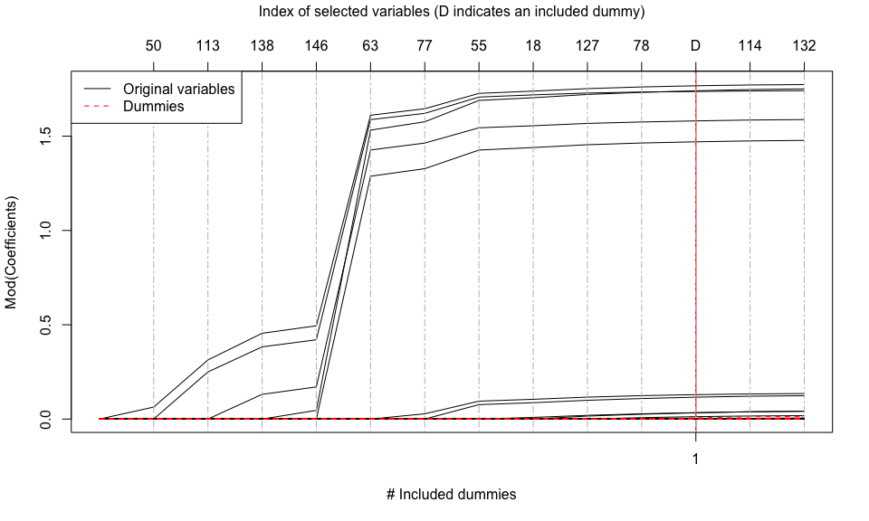

ctlars Algorithm
================

<!-- README.md is generated from README.Rmd. Please edit that file -->

# ctlars

The CTLARS Algorithm: Complex early-terminated Forward Variable
Selection

It computes the solution path of the complex Terminating-LARS (CTLARS)
algorithm. The CTLARS algorithm appends dummy predictors to the original
predictor matrix and terminates the forward-selection process after a
pre-defined number of dummy variables has been selected.

In the following, we show how to use the package and give you an idea of
why terminating the solution path early is a reasonable approach in
high-dimensional and sparse variable selection: In many applications,
most active variables enter the solution path early!

# Installation

You can install the development version of ctlars from
[GitHub](https://github.com/G4Lactus/CTLARS_Package) with:

``` r
# install.packages("devtools")
# devtools::install_github("G4Lactus/CTLARS_Package")
```

# Quick Start

In the following, we illustrate the basic usage of the `ctlars` package
for performing variable selection in space high-dimensional complex data
space, using the CTLARS algorithm.

1.  We generate high-dimensional Gaussian data set with sparse support.

``` r
library(ctlars)

generate_simdata <- FALSE
if (generate_simdata) {
  n <- 100
  p <- 150
  beta_cardinality <- 5
  set.seed(42)

  # generate some data
  data <- generate_ccg_data(n,
                            p,
                            mean_xr = 0,
                            sd_xr = 1,
                            mean_xi = 0,
                            sd_xi = 1,
                            beta_cardinality = beta_cardinality,
                            noise_power = 1,
                            set_snr = TRUE,
                            snr_is_linear = TRUE,
                            snr_val_linear = 2,
                            snr_val_db = 10)

} else {
  data("WCCCGauss_data")
  data <- WCCCGauss_data
}
```

2.  We generate a dummy matrix containing `n` rows and `num_dummies`
    dummy predictors sampled from a white circularly centered symmetric
    complex Gaussian and append it to the original predictor matrix.

``` r
 # Append dummies
 set.seed(789)
 update_data <- function(data_lst, num_dummies = p) {
   p <- ncol(data_lst$X)
   n <- nrow(data_lst$X)
 
   data_lst$X <- cbind(data_lst$X,
     matrix(complex(real = stats::rnorm(n * num_dummies, sd = 1),
                    imag = stats::rnorm(n * num_dummies, sd = 1)),
            nrow = n, ncol = num_dummies)
   )
   
   data_lst$num_dummies <- num_dummies
   data_lst$n <- n
   data_lst$p <- p
 
   return(data_lst)
 }
 data <- update_data(data, num_dummies = ncol(data$X))
```

3.  We generate an object of class `ctlars` and supply the information:

``` r
# Run complex terminating lars algorithm
# ----------------------------------------
ctlars_obj <- ctlars::ctlars$new(data$X,
                                  data$y,
                                  num_dummies = data$num_dummies
                                  )
```

4.  We perform on CTLARS step on `ctlars_obj`, i.e., the CTLARS
    algorithm is run until **t_stop = 1** dummy has entered the solution
    path and stops there:

``` r
ctlars_obj$execute_clars_step(t_stop = 1, early_stop = TRUE, use_chol = TRUE)
#> complex LARS iteration 1 
#> complex LARS iteration 2 
#> complex LARS iteration 3 
#> complex LARS iteration 4 
#> complex LARS iteration 5 
#> complex LARS iteration 6 
#> complex LARS iteration 7 
#> complex LARS iteration 8 
#> complex LARS iteration 9 
#> complex LARS iteration 10 
#> complex LARS iteration 11
```

5.  We evaluate the selection results after **t_stop = 1** dummies have
    been selected.

``` r
# Test
# ----------------------------------------
cat("Proposed index set by CLARS: ", ctlars_obj$get_active_set(), "\n")
#> Proposed index set by CLARS:  50 113 138 146 63 77 55 18 127 78 252
cat("True support: ", drop(data$support), "\n")
#> True support:  50 146 113 138 63
cat("Proposal in true support: ",
     intersect(ctlars_obj$get_active_set(), drop(data$support)), "\n")
#> Proposal in true support:  50 113 138 146 63
cat("Dummies in proposal: ", ctlars_obj$get_active_dummies(), "\n")
#> Dummies in proposal:  252
 
plot(ctlars_obj)
```


